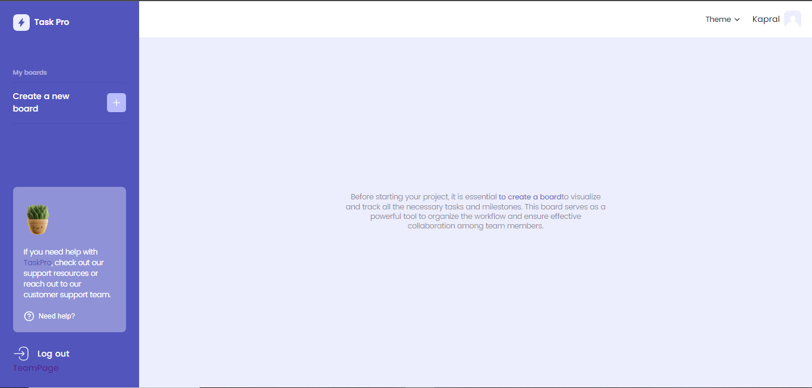
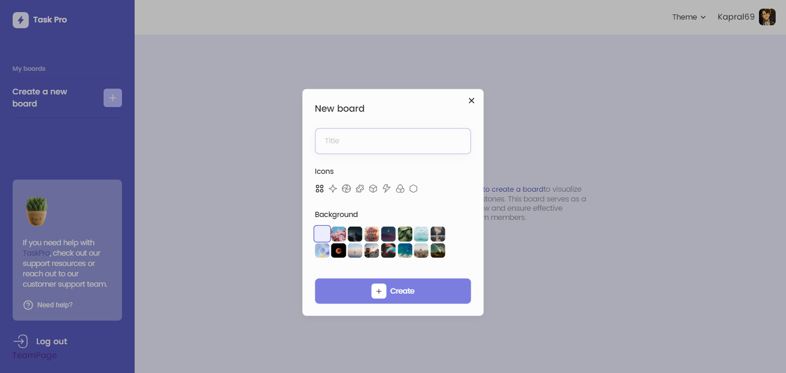
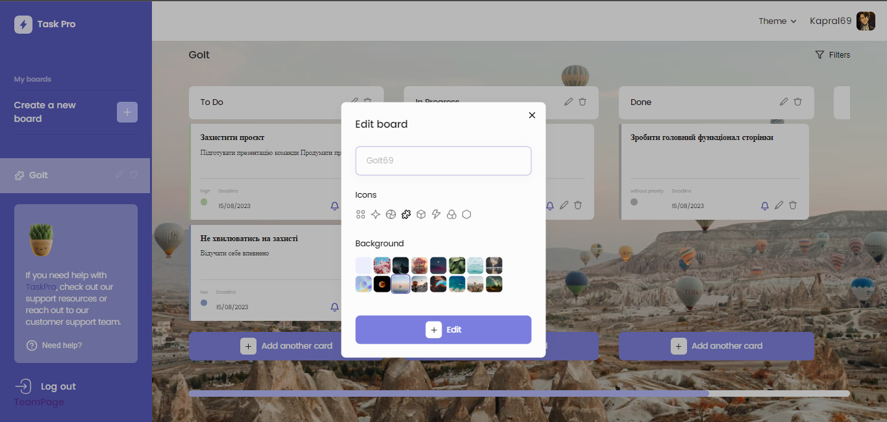
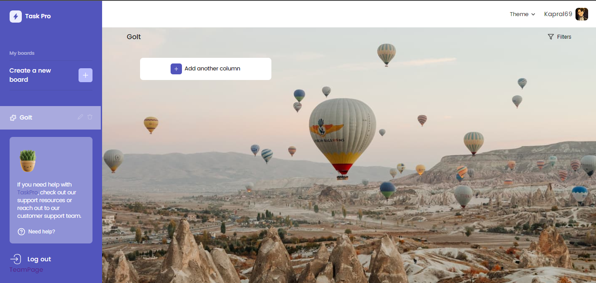
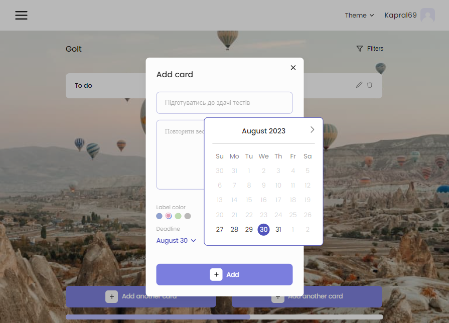
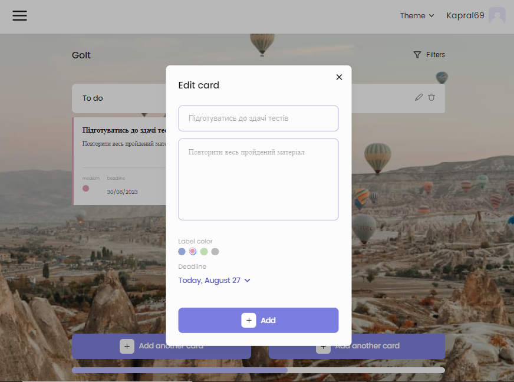
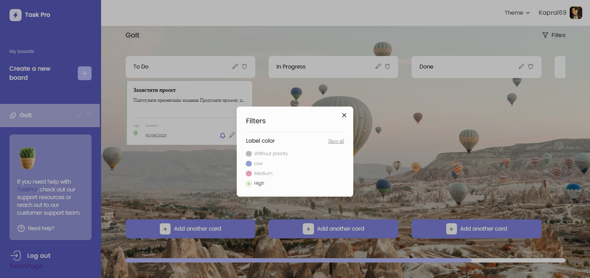
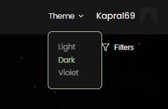
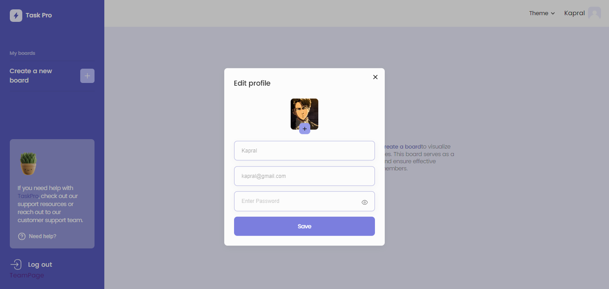
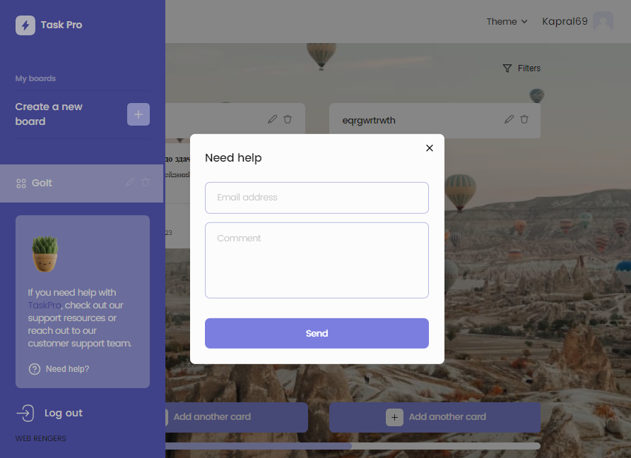

#  TaskPro

**_TaskPro_** This is the perfect tool that reflects the user's values for
effective task management.

**TaskPro** highly values data security and confidentiality. In our application,
advanced encryption methods and reliable authentication mechanisms are employed
to ensure that your confidential information remains secure.

To get started with the application, registration is required. For your
convenience, we have also implemented registration through a Google account.

After registration, the user is directed to the home page, where they can start
working with the application immediately. 

The application's functionality includes:

1. Creating a new board (where users can add columns with tasks).
   
2. Editing boards (users can choose a suitable label and background for the
   board). 
3. Editing columns. 
4. Creating/editing tasks (users can set task priorities and due dates).
    
5. Task filtering. 
6. Changing the app's theme. 
7. Modifying user profiles (the ability to set an avatar, change name, email,
   and password). 
8. Technical support (if users have specific questions or suggestions for
   improving the application, they can send us an email).
   
